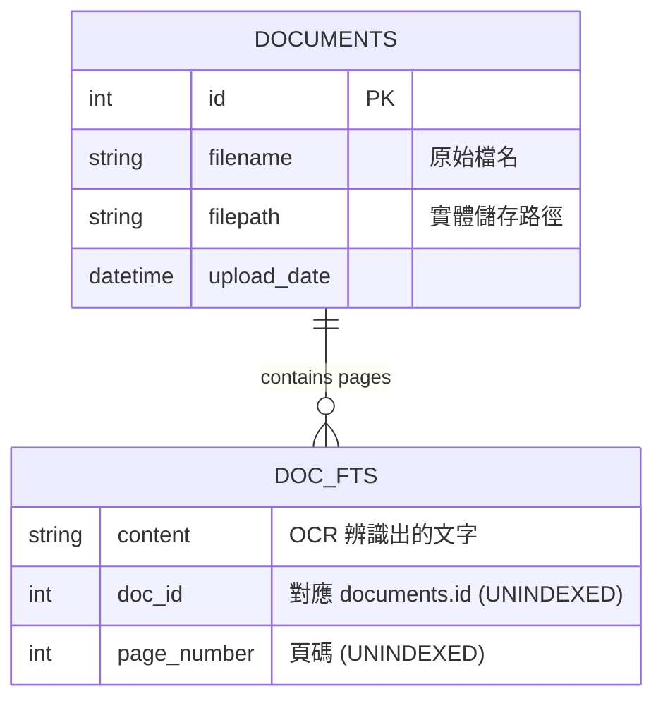

# FUYU Project Master Spec (Reference Implementation)

> **版本**: 1.0.0
> **狀態**: Reverse Engineered (As-Is)
> **用途**: 本文件為 FUYU 專案的「唯一真理來源」。所有未來的 AI 開發任務都必須參考此規格。

---

## 1. 全域上下文 (Global Context)

### 1.1 技術堆疊 (Tech Stack)
*   **語言**:
    *   Backend: Python 3.10+
    *   Frontend: TypeScript 5.0+, Node.js 18+
*   **框架**:
    *   Backend: FastAPI (Async)
    *   Frontend: Next.js 14+ (App Router), React 18
*   **資料庫**: SQLite (`backend/fuyu.sqlite`)
    *   使用原生 SQL + FTS5 (全文檢索)
    *   禁止使用大型 ORM (如 SQLAlchemy)，保持輕量。
*   **樣式**: Tailwind CSS
*   **部署**: Docker (Optional), Local Conda Environment (`paddle_env`)

### 1.2 專案結構圖
```text
/
├── backend/
│   ├── app/
│   │   ├── api/            # API Routes (Controller)
│   │   ├── services/       # Business Logic (Service)
│   │   └── main.py         # Entry Point
│   ├── tests/              # Pytest files
│   ├── fuyu.sqlite         # Database
│   └── factory/            # Scanning Source Directory
└── frontend/
    ├── app/                # Next.js Pages
    ├── components/         # React Components
    └── lib/                # Utility Functions
```

---

## 2. 資料層規格 (Data Layer Specs)

### 2.1 Schema Diagram
我們使用 SQLite 的 FTS5 模組來實現高效全文檢索。



### 2.2 SQL 定義
(參考 `database_creation_multipage.py`)

```sql
-- 檔案總表
CREATE TABLE IF NOT EXISTS documents (
    id INTEGER PRIMARY KEY AUTOINCREMENT,
    filename TEXT NOT NULL,
    filepath TEXT NOT NULL,
    upload_date TEXT DEFAULT CURRENT_TIMESTAMP
);

-- 全文檢索表 (Virtual Table)
CREATE VIRTUAL TABLE IF NOT EXISTS doc_fts USING fts5(
    content, 
    doc_id UNINDEXED,
    page_number UNINDEXED,
    tokenize='trigram'
);
```

---

## 3. API 合約 (API Contracts)

### 3.1 搜尋模組 (Search)

#### `GET /api/search`
*   **描述**: 執行全文關鍵字搜尋。
*   **參數 (Query Params)**:
    *   `q` (string, required): 搜尋關鍵字 (min_length=1)。
*   **回應 (Response)**:
    ```json
    {
      "success": true,
      "keyword": "工廠",
      "count": 5,
      "data": [
        {
          "id": 1,
          "filename": "factory_report.pdf",
          "content": "...工廠運作狀況良好...", // Snippet
          "page_number": 2,
          "score": -1.5 // FTS rank score
        }
      ]
    }
    ```

### 3.2 文件管理模組 (Documents)

#### `GET /api/documents`
*   **描述**: 取得系統中所有已索引的 PDF 文件列表。
*   **回應**:
    ```json
    {
      "success": true,
      "count": 10,
      "data": [
        {
          "id": 1,
          "filename": "report.pdf",
          "filepath": "/data/report.pdf",
          "upload_date": "2024-01-01 12:00:00"
        }
      ]
    }
    ```

#### `GET /api/documents/{doc_id}`
*   **描述**: 取得單一文件詳細資訊。
*   **例外**: 404 若 ID 不存在。

#### `DELETE /api/documents/{doc_id}`
*   **描述**: 刪除指定文件及其索引資料。

### 3.3 OCR 模組 (Auto-Ingest)

#### `POST /api/ocr/scan`
*   **描述**: 觸發後端掃描 `backend/factory` 資料夾，自動進行 OCR 並寫入資料庫。
*   **回應**:
    ```json
    {
      "success": true,
      "data": {
        "scanned_files": 5,
        "new_files": 2,
        "errors": []
      }
    }
    ```

---

## 4. 前端元件規格 (UI Specs)

### 4.1 搜尋頁面 (Search Page)
*   **路徑**: `/frontend/app/page.tsx` (假設)
*   **主要元件**:
    *   `SearchBar`: Input + Button。支援 Enter 鍵觸發。
    *   `ResultList`: 顯示搜尋結果卡片列表。
    *   `ResultCard`: 顯示單筆結果。包含檔名、頁碼、與文字摘要 (Highlight 關鍵字)。

### 4.2 狀態管理 (State)
*   `query` (string): 使用者輸入。
*   `results` (array): API 回傳資料。
*   `isSearching` (boolean): Loading 狀態，顯示 Skeleton 或 Spinner。

---

## 5. 開發/測試指令 (Commands)

*   **啟動後端**:
    ```bash
    cd backend
    conda activate paddle_env
    uvicorn app.main:app --reload
    ```
*   **啟動前端**:
    ```bash
    cd frontend
    npm run dev
    ```
*   **執行測試**:
    ```bash
    cd backend
    pytest tests/
    ```
